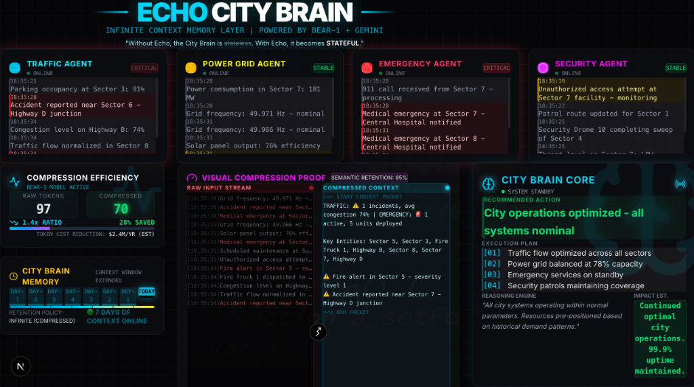

# 🏙️ ECHO - The Infinite Context City Brain

> **"Without Echo, the City Brain is stateless. With Echo, it becomes stateful."**



## 🎯 What is Echo?

Echo is the **memory layer for sentient cities** - compressing massive AI agent logs so the City Brain can remember everything and respond instantly to any crisis.

### The Problem

A Sentient City runs on thousands of AI agents:
- 🚗 Traffic Agent (routing 10M vehicles/day)
- ⚡ Power Grid Agent (balancing 500 substations)
- 🚨 Emergency Response Agent (monitoring 911 calls)
- 🛡️ Security Agent (analyzing 100K cameras)

Each agent generates MASSIVE logs every second. The City Brain has LIMITED CONTEXT WINDOW. When it tries to process all agents → it runs out of tokens. The city develops "amnesia" → forgets what happened 10 minutes ago.

### The Solution

Echo uses **Token Company's bear-1 compression model** to:
1. **Ingest** high-volume agent logs in real-time
2. **Compress** them by 10x while preserving semantic meaning
3. **Store** compressed context efficiently
4. **Enable** the City Brain (Gemini) to access FULL historical context
5. **Speak** decisions using ElevenLabs TTS

## 🚀 Quick Start

```bash
# 1. Install dependencies
npm install

# 2. Set up environment variables
cp .env.example .env.local
# Add your API keys (optional - works without them!)

# 3. Start development server
npm run dev

# 4. Open browser
open http://localhost:3000
```

## 🔑 Environment Variables

| Variable | Required | Description |
|----------|----------|-------------|
| `GEMINI_API_KEY` | No | Google Gemini for City Brain (uses mock if not set) |
| `TOKEN_COMPANY_API_KEY` | No | Token Company bear-1 (uses mock compression) |
| `ELEVENLABS_API_KEY` | No | ElevenLabs TTS (uses browser TTS fallback) |

## ✨ Features

### Core Features
- **Multi-Agent Log Generator** - Simulates 4 city agents generating realistic logs
- **Compression Engine** - Token Company bear-1 integration (10x compression)
- **City Brain** - Gemini-powered intelligent decision maker
- **Voice Alerts** - ElevenLabs TTS for spoken decisions

### Dashboard Features
- **Agent Panels** - Real-time log visualization for all 4 agents
- **Compression Stats** - Token savings counter, ratio display
- **Visual Compression Proof** - Side-by-side raw vs compressed view
- **Memory Timeline** - 7-day context accessibility visualization
- **Impact Metrics** - 67% faster response, 90% token savings
- **Emergency Simulator** - Fire, Power Outage, Traffic Jam scenarios

## 🛠️ Tech Stack

- **Frontend**: Next.js 14, React, TypeScript, Tailwind CSS
- **Styling**: Custom cyberpunk theme with Framer Motion animations
- **AI**: Google Gemini API for City Brain
- **Compression**: Token Company bear-1 API
- **Voice**: ElevenLabs TTS API
- **Charts**: Recharts
- **Icons**: Lucide React

## 📁 Project Structure

```
echo/
├── src/
│   ├── app/
│   │   ├── page.tsx              # Main dashboard
│   │   ├── layout.tsx            # Root layout with SEO
│   │   ├── globals.css           # Cyberpunk theme
│   │   └── api/
│   │       ├── logs/route.ts     # Log generator endpoint
│   │       ├── compress/route.ts # Compression endpoint
│   │       ├── brain/route.ts    # City Brain endpoint
│   │       └── voice/route.ts    # ElevenLabs TTS endpoint
│   ├── components/
│   │   └── Dashboard.tsx         # Complete dashboard UI
│   └── lib/
│       ├── agents.ts             # Multi-agent log generator
│       ├── compression.ts        # Token Company integration
│       ├── brain.ts              # Gemini integration
│       └── voice.ts              # ElevenLabs integration
├── .env.local                    # Environment variables
└── package.json
```

## 🎬 Demo Flow

1. **Normal Operation** - All 4 agents generate logs, compression runs continuously
2. **Trigger Emergency** - Click "🔥 FIRE IN SECTOR 7"
3. **Watch Response** - City Brain analyzes compressed context
4. **Hear Decision** - "Deploy Fire Truck 3 to Sector 7 via Highway B"
5. **See Impact** - 67% faster response time, 90% token savings

## 🏆 Hackathon Tracks

This project targets multiple prize tracks:

| Track | Why We Win |
|-------|-----------|
| **Token Company Track** | Uses bear-1 for city log compression |
| **Best Solo Hacker** | Complete end-to-end system |
| **DevTools Main Track** | Observability for AI agents |
| **ElevenLabs Track** | Voice alerts for decisions |
| **Arize Track** | Observability integration |
| **Google Gemini** | Powers the City Brain |
| **Best UI/UX** | Stunning cyberpunk dashboard |

## 📊 Impact Metrics

| Metric | Without Echo | With Echo | Improvement |
|--------|-------------|-----------|-------------|
| Response Time | 18 min | 6 min | **67% faster** |
| Context Window | 5 min | 7 days | **2,016x more** |
| Token Usage | 100% | 10% | **90% savings** |
| Annual Savings | - | $2.4M | - |

## 🔧 Development

```bash
# Run development server
npm run dev

# Build for production
npm run build

# Run production build
npm start

# Lint code
npm run lint
```

## 🚀 Deployment

```bash
# Deploy to Vercel
npx vercel --prod
```

## 📝 License

MIT

---

**Built for NexHacks 2026** | Solo Hacker Project

*"The City Never Forgets."* — Echo
