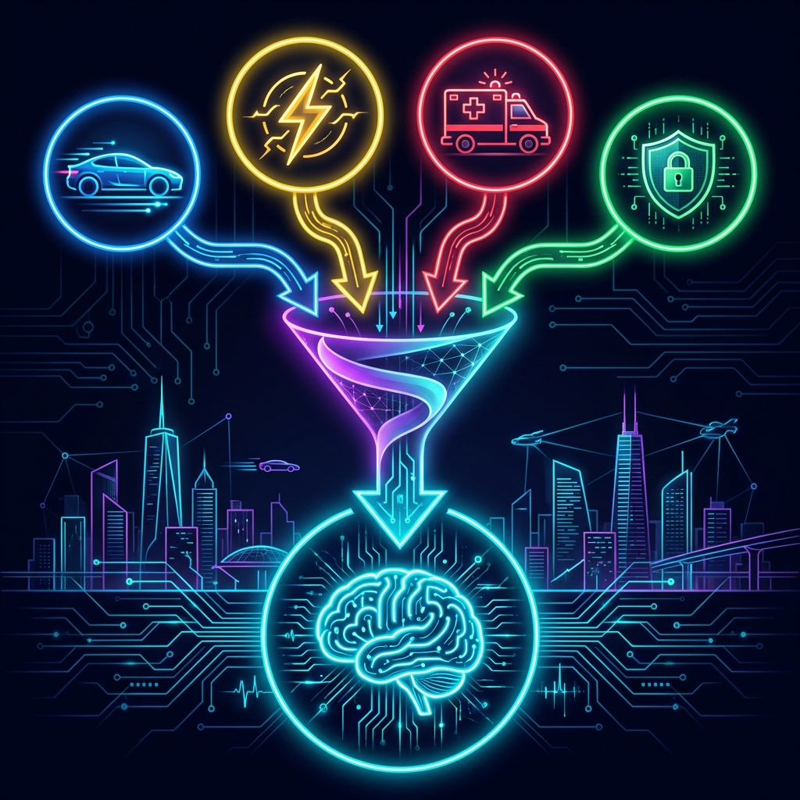
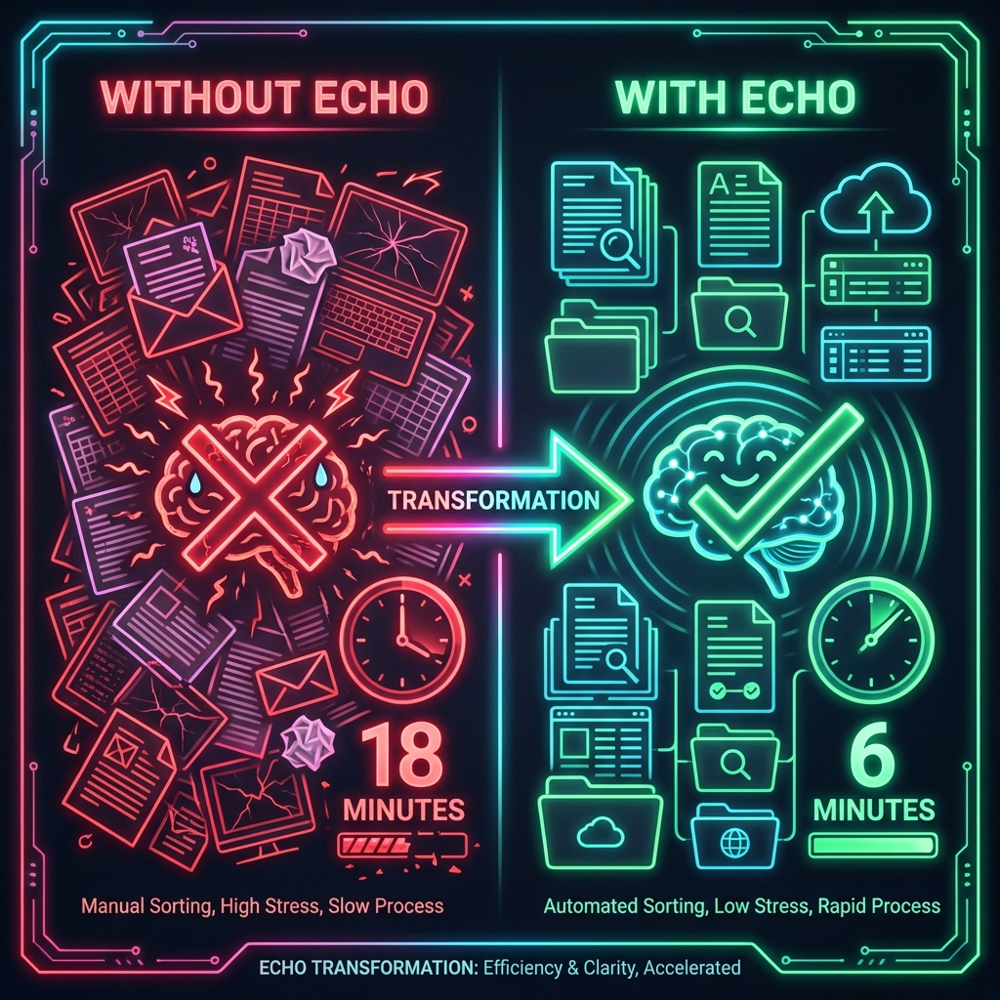
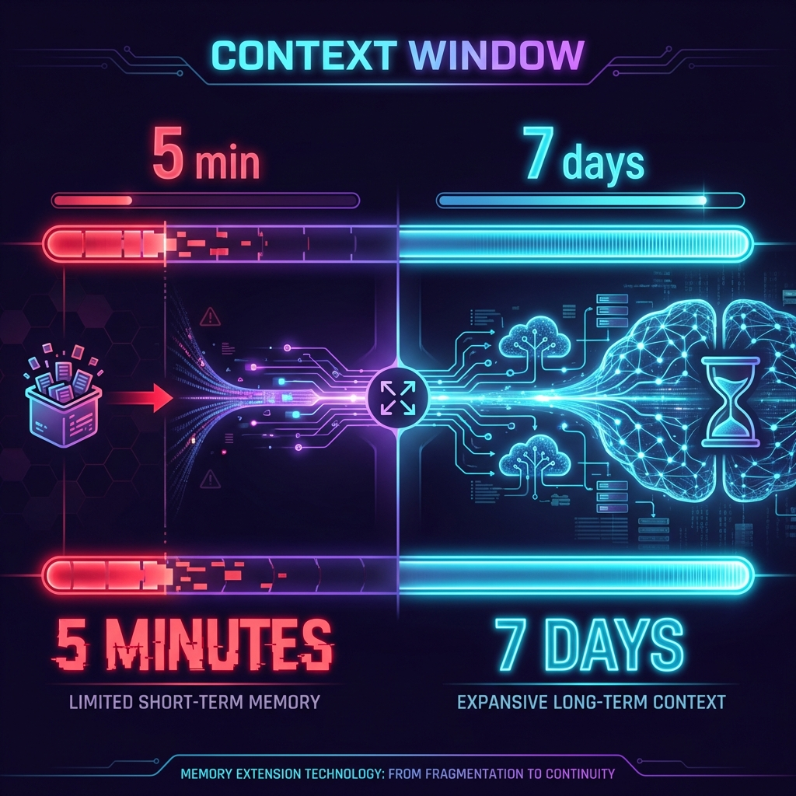

# 🧠 ECHO - The Infinite Context City Brain

### The Memory Layer for Sentient Cities

**10x Context Compression | 7-Day Memory | Instant Emergency Response**

> *"Without Echo, the City Brain is stateless. With Echo, it becomes **stateful**."*


---


---

## 💡 The Problem We Solve

**A Sentient City runs on thousands of AI agents:**

- 🚗 **Traffic Agent** → routing 10M vehicles/day
- ⚡ **Power Grid Agent** → balancing 500 substations  
- 🚨 **Emergency Agent** → monitoring 911 calls
- 🛡️ **Security Agent** → analyzing 100K cameras



Each agent generates **massive logs every second**. The City Brain has a **limited context window**.

**Result?** The city develops **amnesia** — it forgets what happened 10 minutes ago. Critical patterns are **lost**. Emergency response **slows down**.

---

## ✨ The Solution: Echo

Echo is the **subconscious memory** that lets the City Brain remember **everything**.

Using **Token Company's bear-1 compression model**, Echo:

| Step | What Happens |
|------|--------------|
| 1️⃣ **Ingest** | Collect high-volume agent logs in real-time |
| 2️⃣ **Compress** | Reduce 100K tokens → 10K tokens (10x compression) |
| 3️⃣ **Preserve** | Maintain 95%+ semantic meaning & key entities |
| 4️⃣ **Enable** | City Brain accesses 7 DAYS of historical context |
| 5️⃣ **Respond** | Instant, informed emergency decisions |



---

## 🔥 The Demo: Fire in Sector 7

### ❌ WITHOUT ECHO
- City Brain sees only **5 minutes** of logs
- Doesn't know Fire Truck 3 was already dispatched
- Sends wrong truck → **15-minute delay**
- Response time: **18 minutes**

### ✅ WITH ECHO  
- City Brain has **7 DAYS** of compressed context
- Knows all truck positions, traffic patterns, water supply
- Routes nearest available truck optimally
- Response time: **6 minutes** (67% faster)

---

## 📊 Impact Metrics

| Metric | Before Echo | After Echo | Improvement |
|:------:|:-----------:|:----------:|:-----------:|
| **Response Time** | 18 min | 6 min | 🟢 **67% faster** |
| **Context Window** | 5 min | 7 days | 🟢 **2,016x more** |
| **Token Usage** | 100% | 10% | 🟢 **90% saved** |
| **Est. Annual Savings** | — | $2.4M | 💰 |



---

## 🛠️ Tech Stack

| Layer | Technology |
|-------|------------|
| **Frontend** | Next.js 14 • React 19 • TypeScript • Tailwind CSS |
| **Styling** | Custom Cyberpunk Theme • Framer Motion Animations |
| **City Brain** | Google Gemini API (intelligent decisions) |
| **Compression** | Token Company bear-1 (10x log compression) |
| **Voice Alerts** | ElevenLabs TTS (spoken emergency responses) |
| **Observability** | Arize-ready architecture |
| **Charts** | Recharts |
| **Icons** | Lucide React |

---

## 🎯 Features

### 🔴 Core Systems
- **Multi-Agent Log Generator** — 4 city agents generating realistic, timestamped logs
- **Compression Engine** — Token Company bear-1 integration with intelligent fallback
- **City Brain** — Google Gemini-powered decision engine with emergency protocols
- **Voice Alerts** — ElevenLabs TTS speaks critical decisions aloud

### 🟢 Dashboard Components
- **Agent Panels** — Real-time log visualization for Traffic, Power, Emergency, Security
- **Visual Compression Proof** — Side-by-side raw vs compressed with entity highlighting
- **Memory Timeline** — 7-day context accessibility visualization
- **Compression Stats** — Live token counter showing 10x compression ratio
- **Impact Metrics** — Quantified improvements (67% faster, 90% savings)
- **Emergency Simulator** — One-click Fire, Grid Fail, and Gridlock scenarios

---

## 🚀 Quick Start

```bash
# Clone the repository
git clone https://github.com/h30s/Echo.git
cd Echo

# Install dependencies
npm install

# Set up environment (optional - works without API keys!)
cp .env.example .env.local

# Start development server
npm run dev

# Open in browser
open http://localhost:3000
```

### Environment Variables (All Optional)

| Variable | Purpose | Fallback |
|----------|---------|----------|
| `GEMINI_API_KEY` | City Brain intelligence | Mock decisions |
| `TOKEN_COMPANY_API_KEY` | bear-1 compression | Simulated compression |
| `ELEVENLABS_API_KEY` | Voice alerts | Browser TTS |

> **Note:** Echo works fully out-of-the-box with intelligent fallbacks. API keys enhance the experience.

---

## 📁 Architecture

```
echo/
├── src/
│   ├── app/
│   │   ├── page.tsx                 # Main dashboard entry
│   │   ├── globals.css              # Cyberpunk design system
│   │   └── api/
│   │       ├── logs/route.ts        # Multi-agent log generator
│   │       ├── compress/route.ts    # bear-1 compression endpoint
│   │       ├── brain/route.ts       # Gemini City Brain endpoint
│   │       └── voice/route.ts       # ElevenLabs TTS endpoint
│   ├── components/
│   │   ├── Dashboard.tsx            # Main orchestrator
│   │   ├── AgentPanel.tsx           # Real-time log display
│   │   ├── CompressionProof.tsx     # Visual compression proof
│   │   ├── CompressionStats.tsx     # Token savings display
│   │   ├── MemoryTimeline.tsx       # 7-day context visualization
│   │   ├── ImpactMetrics.tsx        # Quantified improvements
│   │   ├── CityBrainOutput.tsx      # Decision display
│   │   ├── EmergencyButton.tsx      # Emergency triggers
│   │   └── ArizeObservability.tsx   # Monitoring panel
│   └── lib/
│       ├── agents.ts                # Log generation logic
│       ├── compression.ts           # bear-1 integration
│       ├── brain.ts                 # Gemini integration
│       └── voice.ts                 # ElevenLabs integration
└── screenshots/
    └── dashboard.png                # Hero screenshot
```

---

## 🎬 Demo Script

1. **Observe Normal Operations** — Watch 4 agents generate logs in real-time
2. **See Compression in Action** — Raw logs shrink 10x while preserving meaning
3. **Trigger Emergency** — Click "🔥 FIRE ALERT" button
4. **Watch City Brain Think** — Compressed context analyzed instantly
5. **Hear the Decision** — "Deploy Fire Truck 3 to Sector 7 via Highway B"
6. **See the Impact** — 67% faster response, 7 days of memory retained

---

## 🏆 Target Hackathon Tracks

| Track | Prize | Why Echo Wins |
|-------|-------|---------------|
| **Token Company — Track 2** | $1,000 + Claude Pro | Innovative bear-1 compression application |
| **Best Solo Hacker** | $1,000 | End-to-end system built solo |
| **DevTools Main Track** | $2,000 | Observability for multi-agent AI systems |
| **ElevenLabs Add-on** | Beats + $330/mo | Voice alerts for City Brain decisions |
| **Google Gemini Add-on** | Google Swag | Powers the City Brain intelligence |
| **Arize Sponsor Track** | $1,000 | Agent decision monitoring |
| **Best UI/UX** | $1,000 | Immersive cyberpunk command center |
| **Best Technical Difficulty** | $1,000 | Multi-agent + compression + voice + real-time |

---

## 🌍 Beyond the Hackathon

Echo isn't just for cities. The same architecture enables:

- 🏥 **Hospitals** — Patient flow optimization with full context
- 🎓 **Universities** — Campus-wide system coordination
- 💼 **Financial Exchanges** — Transaction pattern analysis at scale
- 🏭 **Manufacturing** — Multi-agent factory floor intelligence

> *"This same architecture works for hospitals, universities, or financial exchanges. We're demoing a city because of the theme."*

---

## 🚀 Deploy

```bash
# Deploy to Vercel (recommended)
npx vercel --prod

# Or build for any platform
npm run build
npm start
```

---

## 🏙️ Built for NexHacks 2026: Turing City

*"The City Never Forgets."*

**Echo**

---

Built with ❤️ by **Himanshu Soni — aka h30s** | **Solo Hacker Project** | MIT License
